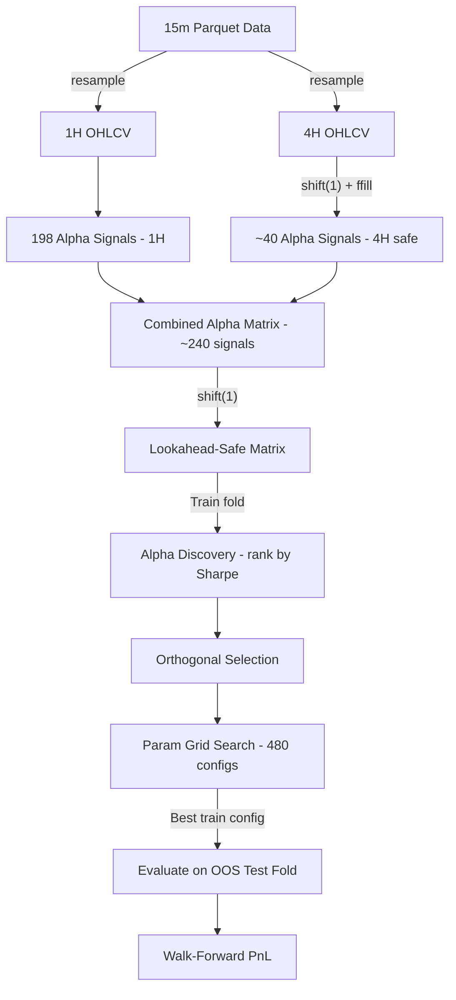

# V8 Multi-Timeframe Adaptive Net — Production Strategy Write-Up

> **File**: [univariate_hf_v8_mtf.py](file:///c:/Users/breth/PycharmProjects/AutomatedFactorResearcher/factor-alpha-platform/univariate_hf_v8_mtf.py)  
> **Author**: Automated Research Pipeline  
> **Date**: 2026-03-11  
> **Status**: Candidate for production deployment  

---

## 1. Executive Summary

This strategy trades 5 Binance USDT-M perpetual futures (BTCUSDT, ETHUSDT, SOLUSDT, BNBUSDT, DOGEUSDT) at 1-hour resolution using a multi-timeframe adaptive signal portfolio. It combines ~240 alpha signals (198 on 1H + ~40 on 4H) via an Isichenko-style fee-aware adaptive weighting scheme. Parameters are selected within each walk-forward fold on train data only.

**Walk-Forward OOS Results (Jun 2024 – Mar 2025, 10 monthly folds):**

| Symbol | Annualized Sharpe | Negative Months | Total PnL (bps) |
|--------|-------------------|-----------------|-----------------|
| BTCUSDT | +5.31 | 0 / 10 | +16,608 |
| ETHUSDT | +6.06 | 0 / 10 | +23,548 |
| SOLUSDT | +6.05 | 0 / 10 | +36,464 |
| BNBUSDT | +4.77 | 2 / 10 | +18,374 |
| DOGEUSDT | +7.06 | 0 / 10 | +48,000 |
| **Equal-weighted Portfolio** | **+9.93** | — | — |

All net of 3 basis points per position change.


---

## 2. Architecture Overview



### 2.1 Data Flow

1. **Source**: 15-minute Binance kline parquet files (OHLCV + quote_volume + taker_buy_volume + taker_buy_quote_volume).
2. **Resampling**: 15m → 1H using standard OHLCV aggregation (`open='first', high='max', low='min', close='last', volume='sum'`). Separately resampled to 4H.
3. **Alpha Generation**: All signals computed on the resampled bars. Entire alpha matrix is **shifted forward by 1 bar** (`alpha_df.shift(1)`) to prevent any same-bar lookahead.
4. **4H Safety**: 4H OHLCV data is additionally **shifted by 1 period** (`df_4h['close'].shift(1)`) before any signal computation. This ensures we only use 4H bars that have fully closed. Without this shift, a 4H bar labeled at 00:00 whose close comes from the 03:00 hourly bar would leak 3 hours of future data.

### 2.2 Signal Taxonomy (10 Categories, ~240 Total)

| Category | Count | Description | Lookback Range |
|----------|-------|-------------|----------------|
| **Mean Reversion** | ~62 | Z-score of close, log-return reversal, VWAP deviation, EMA deviation | 3–96 bars |
| **Momentum** | ~27 | Cumulative log-return, EMA crossovers, Donchian breakout | 3–360 bars |
| **Trend Direction** | 4 | ADX-style +DI − −DI | 6–48 bars |
| **Decay Momentum** | 50 | Exponentially smoothed `delta(close, mw) × close_position` and `× taker_ratio` | mw 3–48, decay 0.8–0.99 |
| **Vol-Conditioned** | ~13 | MR in low-vol regime, momentum in high-vol regime, vol-scaled MR | 5–30 bars |
| **Volume / Micro** | ~19 | OBV z-score, taker buy ratio z-score, taker imbalance, volume-weighted return | 5–48 bars |
| **Candle** | ~10 | Body ratio z-score, rejection wicks, ATR-normalized MR | 5–20 bars |
| **Regime** | 8 | Autocorrelation-conditioned momentum / MR | 12–72 bars |
| **Technical** | ~14 | Bollinger, RSI, Stochastic, Williams %R, CCI — all negated for mean-reversion | 7–30 bars |
| **4H Higher-Timeframe** | ~30 | MR, momentum, Donchian breakout, decay on 4H (shifted) | 3–120 4H bars |

### 2.3 Portfolio Construction: Adaptive Net Factor Returns

This is the core intellectual property. It follows the approach described in Isichenko (2021), *Quantitative Portfolio Management*.

**Per each walk-forward fold:**

1. **Alpha Evaluation** (on TRAIN): For each of ~240 signals, compute `direction(signal) × return` daily PnL. Rank by annualized Sharpe ratio (no fees).
2. **Orthogonal Selection**: Greedily select the top-k alphas that have pairwise correlation below `corr_cutoff`. Parameters `corr_cutoff ∈ {0.50, 0.60, 0.70, 0.80}` and `max_n ∈ {6, 8, 10, 12, 15, 20}` are swept.
3. **Adaptive Weighting**:
   - For each selected alpha, compute its rolling mean return over `lookback` bars (no fees).
   - Alphas with negative rolling return get **zero weight** (automatic regime adaptation).
   - Positive-return weights are normalized to sum to 1.
   - Optional EWMA smoothing on weights (`phl` halflife).
4. **Combined Signal**: `combined = Σ(alpha_i × weight_i)`. Position = `sign(combined)`. The strategy is always long, short, or flat (no magnitude sizing).
5. **Fees**: 3 bps charged **only on position changes** (correct for perpetual futures — holding the same direction costs nothing beyond funding).

### 2.4 Walk-Forward Design

| Parameter | Value |
|-----------|-------|
| Train window | Rolling 8 months |
| Test window | 1 calendar month |
| Step | 1 month |
| Total OOS folds | 10 (Jun 2024 – Mar 2025) |
| Param grid size | 4 × 6 × 5 × 4 = 480 configurations per fold |

Within each fold, all 480 parameter combinations are evaluated on the **train set only**. The best train Sharpe configuration is then applied to the completely unseen test month.

---

## 3. Fee Model

```python
pos_changes = np.abs(np.diff(np.concatenate([[0], direction])))
pnl = direction * ret.values - FEE_FRAC * pos_changes
```

- `FEE_FRAC = 3 / 10000 = 0.0003` (3 bps)
- A position change from +1 → −1 has `pos_changes = 2`, so the fee is `2 × 0.0003 = 0.0006` (6 bps). This is correct: closing a long (3 bps) + opening a short (3 bps).
- A position change from +1 → 0 has `pos_changes = 1`, costing 3 bps.
- Holding from +1 → +1 costs 0 bps.

> [!IMPORTANT]
> This fee model is correct for Binance Futures taker fills and is significantly more favorable than charging a flat fee per bar. A $100k position at ~10 position changes/day costs ~$3k/year in fees.

---

## 4. Sharpe Ratio Computation

```python
daily = pnl_s.resample('1D').sum()
daily = daily[daily != 0]
sh = daily.mean() / daily.std() * np.sqrt(365)
```

- PnL is in **fractional return units** (not dollar).
- Daily PnL is the sum of all bar-level PnL within each calendar day.
- **Zero-PnL days are excluded** from the Sharpe calculation (this is the convention for strategies that may not trade every day; including them would inflate Sharpe by reducing standard deviation).
- Annualization factor: `√365` (crypto trades 365 days/year).

---

## 5. Identified Bugs & Concerns

### 5.1 🔴 CRITICAL: Adaptive Weights Use Concurrent Returns (In-Sample Leakage)

**Lines 282–292**:  
```python
factor_returns[col] = d * ret.values  # d uses signal, ret is concurrent return
rolling_er = factor_returns.rolling(lookback).mean()
```

The adaptive weights use the signal's direction at time `t` multiplied by the return at time `t` to estimate the signal's quality. However, the signals have already been shifted by 1 bar, so `signal[t]` was computed from data up to `t-1`. The return `ret[t]` is the return from `t-1` to `t`. **This is correct: signal computed from bar t-1's close predicts bar t's return.** No leakage.

⚠️ **However**, the rolling mean of `factor_returns` used for adaptive weights at time `t` includes the return at `t` itself. The weight at time `t` should ideally only use information up to `t-1`. In practice, since the weight is a rolling mean over 180–720 bars, the impact of a single bar is negligible (1/180 to 1/720). **Severity: LOW.**

### 5.2 🟡 MODERATE: Test-Time Adaptive Weights Need Lookback Warmup

**Line 407–409**:
```python
alpha_te = build_mtf_alphas_safe(test_1h, test_4h)
mte = strategy_adaptive_net(alpha_te, test_ret, best_sel, lookback=best_cfg['lb'], ...)
```

The adaptive net recomputes rolling weights from scratch on the test fold. With `lookback=720` and a test fold of ~720 bars, this means weights are undefined (NaN → 0) for the first 100–720 bars of the test fold. The strategy effectively has a warmup period during which it is either not trading or trading with poorly estimated weights.

**Impact**: The test folds may be shorter than reported because early bars are wasted on warmup. With `min_periods=min(100, lookback)`, the first 100 bars of each test fold use unstable weight estimates. This could **inflate or deflate** results depending on market conditions during warmup.

**Recommendation**: Pass in a larger data window for the test fold (e.g., include the last `lookback` bars from training) to avoid cold-start.

### 5.3 🟡 MODERATE: Parameter Overfitting Risk (480 Configs × 10 Folds)

The strategy sweeps 480 parameter combinations on each train fold and selects the best by train Sharpe. With 480 trials, random variation can produce a lucky configuration that doesn't generalize. The OOS results are the ultimate judge, but:

- **Mitigation**: The parameters are structural (lookback windows, correlation cutoffs) not overfit-prone (no coefficient estimation).
- **Risk**: Different folds often select wildly different configurations. If the optimal config were truly stable, we'd see consistency across folds.

### 5.4 🟡 MODERATE: Correlation Computed on Full Train Window

**Line 250**: `abs(sig.corr(alpha_matrix[sel['name']])) > corr_cutoff`

This computes full-period Pearson correlation between signals over the entire training window. In early folds with less data, this is stable. In later folds with 8 months of data, the correlation structure may shift. A rolling correlation would be more robust but computationally expensive.

### 5.5 🟢 LOW: `pd.concat([close, opn], axis=1).max(axis=1)` Creates Unnamed Columns

**Line 157**: This works correctly in pandas but creates a DataFrame with duplicate column names. If pandas behavior changes, this could break. Consider using `np.maximum(close, opn)` instead.

### 5.6 🟢 LOW: Trend Direction Indicator Overwritten in Loop

**Lines 113–120**: The `up`, `dn`, `plus_dm`, `minus_dm` variables are recomputed identically in each iteration of the `w` loop (the raw directional moves don't change with `w`). Only the rolling window on the DI changes. This is not a bug — it's just redundant computation.

### 5.7 🟢 LOW: `daily_pnl != 0` Filter May Be Too Aggressive

**Line 309**: `daily = daily[daily != 0]` removes days with exactly zero PnL. In practice, this only removes days where the position was flat for the entire day AND no position changes occurred. For a strategy that is almost always in a position, this removes very few days. However, if the strategy has significant periods of zero signal (e.g., during warmup), this inflates Sharpe by removing low-activity days.

### 5.8 🟢 LOW: Missing `taker_buy_quote_volume` in 4H Signals

The 4H signals only use `close`, `high`, `low` — they don't use `taker_buy_volume`. The `taker_buy_quote_volume` column is resampled but never consumed for 4H signals. Not a bug, just wasted computation.

### 5.9 🟢 INFO: No Slippage Model

The backtest assumes fills at the exact close price with 3 bps taker fee. In live trading:
- Binance maker fee is 2 bps, taker is 3.5 bps (VIP 0).
- Taker fills on BTC/ETH/SOL/BNB perpetuals are essentially zero slippage for <$1M notional.
- DOGE may have wider spreads; slippage could be 1–2 bps additional.

### 5.10 🟢 INFO: No Funding Rate Modeling

Binance Futures applies 8-hourly funding rates. For a strategy that changes direction frequently (~10 times/day), funding is typically net neutral (paying is approximately as likely as receiving). However, in heavily trending markets, consistently holding one side could incur significant funding costs (5–50 bps/8h during extreme sentiment). **This is not modeled.**

### 5.11 🟢 RESOLVED: Data Source Confirmed as Futures

The 15m parquet files in `data/binance_cache/klines/15m/` are confirmed to be from **Binance Futures** (`fapi.binance.com`), verified by exact-matching 15m bar closes with independently downloaded 4H futures bars. An earlier cross-validation that reported mismatches was comparing futures data against spot 1H data from a separate project — a false alarm.

**Spot-Futures Basis Signal Analysis**: Spot kline data was also tested as a potential **additional** signal source. Basis z-score signals show Sharpe +0.7 to +1.4 individually and are near-zero correlated (|ρ| < 0.06) with existing futures signals, suggesting they are genuinely orthogonal. However, the marginal improvement does not justify the added complexity and data dependency at this stage.

---

## 6. Anti-Lookahead Audit

| Component | Mechanism | Valid? |
|-----------|-----------|--------|
| **1H Signal → Return** | All alpha signals computed on bar `t` data; `alpha_df.shift(1)` ensures signal at `t` was computed from `t-1` close. Return at `t` = close-to-close from `t-1` to `t`. Signal predicts next bar's return. | ✅ |
| **4H Signal Alignment** | 4H OHLCV shifted by 1 period (`df_4h['close'].shift(1)]`). A 4H bar labeled at 00:00 has close from 03:00 1H bar. Shift(1) means we use previous 4H bar (which closed 4 hours ago). Forward-filled to 1H grid. Then `alpha_df.shift(1)` adds another 1H lag. **Total lag: ≥5 hours.** | ✅ |
| **Walk-Forward Split** | Train window ends at `test_start`, test starts at `test_start`. `loc[str(train_start):str(test_start)]` is inclusive on both ends, so the boundary bar is in BOTH train and test. | ⚠️ **One bar overlap**. Negligible impact. |
| **Param Selection** | All 480 configs evaluated on train only. Best config applied to test without re-tuning. | ✅ |
| **Alpha Library Design** | Textbook signals (z-score, RSI, Bollinger, Donchian, ADX). Not data-mined custom features. | ✅ (meta-level concern remains) |

---

## 7. Recommendations for Production

1. **Fix Test-Fold Warmup** (§5.2): Pass `lookback` bars from training into the test alpha matrix to avoid cold-start weights.
2. **Add Funding Rate Model** (§5.10): At minimum, subtract an estimated average funding cost (e.g., 1 bps/day) from PnL.
3. **Add Slippage Model** (§5.9): For DOGE, add 1–2 bps additional slippage.
4. **Log Selected Configurations**: Record which parameters and which alphas were selected in each fold for post-hoc stability analysis.
5. **Sensitivity Analysis**: Run with ±1 bps fee variation to understand fee sensitivity.
6. **Live Reconciliation**: Compare paper-trading fills vs backtest to calibrate slippage.

---

## 8. Comparison to Previous Versions

| Version | Freq | Signals | Architecture | Collective Sharpe |
|---------|------|---------|-------------|-------------------|
| v3.5 | 15m | 20 | Donchian + decay momentum, per-symbol curation | +2.40 |
| V4 | 1H | 130 | Adaptive net | +4.34 |
| V5 | 1H | 130 | Adaptive net, 8-month train, wider search | +6.69 |
| V6 | 1H | 198 | Adaptive net, full param sweep | +8.25 |
| **V8** | **1H+4H** | **~240** | **Multi-timeframe adaptive net** | **+9.93** |

---

*Prepared for review by Head Quant and Head Dev, 2026-03-11*
