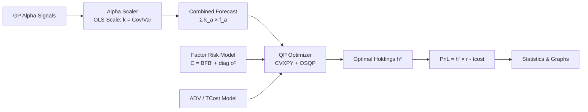

# Isichenko Stat-Arb Pipeline — Detailed Walkthrough

> Implementation of *Quantitative Portfolio Management* (Michael Isichenko, 2021)
> Codebase: `src/pipeline/isichenko.py` + `run_isichenko_pipeline.py`

---

## Table of Contents

1. [Overview & Architecture](#1-overview--architecture)
2. [Configuration](#2-configuration)
3. [Data Loading & Preparation](#3-data-loading--preparation)
4. [Stage 1: Alpha Scaling (Isichenko Eq 2.32)](#4-stage-1-alpha-scaling)
5. [Stage 2: Factor Risk Model (Isichenko Ch 4)](#5-stage-2-factor-risk-model)
6. [Stage 3: QP Optimizer (Isichenko Eq 6.6)](#6-stage-3-qp-optimizer)
7. [Stage 4: Sequential Backtester](#7-stage-4-sequential-backtester)
8. [Fee Structure & Transaction Costs](#8-fee-structure--transaction-costs)
9. [Daily Loop Step-by-Step](#9-daily-loop-step-by-step)
10. [Statistics & Output](#10-statistics--output)
11. [Current Performance](#11-current-performance)
12. [Known Issues & Future Work](#12-known-issues--future-work)

---

## 1. Overview & Architecture

The pipeline is a **sequential day-by-day walk-forward backtester** that operates on a universe of ~500 US equities. It takes GP-discovered alpha signals, scales them into return forecasts, manages risk through a factor model, and computes optimal dollar-neutral long/short portfolios via quadratic programming.



### File Map

| File | Purpose |
|------|---------|
| [isichenko.py](file:///c:/Users/breth/PycharmProjects/AutomatedFactorResearcher/factor-alpha-platform/src/pipeline/isichenko.py) | Core pipeline: `PipelineConfig`, `AlphaScaler`, `FactorRiskModel`, `PortfolioOptimizerQP`, `IsichenkoPipeline` |
| [run_isichenko_pipeline.py](file:///c:/Users/breth/PycharmProjects/AutomatedFactorResearcher/factor-alpha-platform/run_isichenko_pipeline.py) | Runner: loads data, loads GP alphas from DB, runs pipeline, prints stats, generates graphs |
| [run_data_cleaner.py](file:///c:/Users/breth/PycharmProjects/AutomatedFactorResearcher/factor-alpha-platform/run_data_cleaner.py) | Cleans raw FMP data → `matrices_clean/` |
| [run_gp_top2000.py](file:///c:/Users/breth/PycharmProjects/AutomatedFactorResearcher/factor-alpha-platform/run_gp_top2000.py) | GP alpha discovery on TOP1000 universe |

---

## 2. Configuration

All parameters are in the `PipelineConfig` dataclass ([isichenko.py:29-63](file:///c:/Users/breth/PycharmProjects/AutomatedFactorResearcher/factor-alpha-platform/src/pipeline/isichenko.py#L29-L63)):

### Periods
| Parameter | Default | Description |
|-----------|---------|-------------|
| `is_start` | `2020-01-01` | In-sample training start |
| `oos_start` | `2024-01-01` | Out-of-sample start |
| `warmup_days` | `120` | Days to warm up risk model & alpha scalers before IS |

### Universe
| Parameter | Default | Description |
|-----------|---------|-------------|
| `universe_name` | `TOP3000` | Universe file to load |
| `min_coverage` | `0.3` | Min fraction of days ticker must be in universe |
| `min_adv` | `$1M` | Min 20-day ADV |
| Actual universe | **500 tickers** | Runner filters to top 500 by ADV for QP performance |

### Optimizer
| Parameter | Default | Isichenko Ref |
|-----------|---------|---------------|
| `risk_aversion` (κ) | `1e-6` | Eq 6.6 |
| `booksize` | `$20M` | GMV target |
| `max_position_pct_gmv` | `2%` | Max position = 2% of booksize = $400K |
| `max_position_pct_adv` | `5%` | Max position = 5% of ADV |
| `dollar_neutral` | `True` | Σh = 0 constraint |
| `sector_neutral` | `True` | Soft penalty on sector exposure |

### Transaction Costs
| Parameter | Default | Isichenko Ref |
|-----------|---------|---------------|
| `slippage_bps` | `1.0` | Ch 5 — linear cost per $ traded |
| `impact_coeff` | `0.1` | Ch 5 — market impact: `0.1 × σ / √ADV × trade²` |
| `borrow_cost_bps` | `1.0` | Ch 5.3 — daily cost on short notional (~2.5% ann) |

---

## 3. Data Loading & Preparation

### Step 3.1: Load Universe
```python
universe_df = pd.read_parquet("data/fmp_cache/universes/TOP3000.parquet")
```
Boolean DataFrame: `(dates × tickers)` — True if ticker is in TOP3000 on that date.

### Step 3.2: Filter Tickers
1. Require ≥30% coverage across IS period
2. Further filter to **top 500 by 20-day ADV** (for QP solver speed)

### Step 3.3: Load Clean Matrices
```python
mdir = "data/fmp_cache/matrices_clean"  # cleaned data
```
- 234 parquet files, each `(dates × tickers)` — one per field
- **Clean data** has been processed by `run_data_cleaner.py`:
  - Prices: removed > $1M (reverse split artifacts)
  - Returns: clipped to ±100%
  - Ratios: winsorized 1st/99th percentile
  - Per-share: removed > $1M, winsorized
  - All fields: forward-filled NaN ≤ 5 days

### Step 3.4: Load GP Alphas
```python
SELECT expression, sharpe FROM alphas JOIN evaluations 
WHERE sharpe >= 0.5 ORDER BY sharpe DESC
```
Currently: **30 alphas** with Sharpe ≥ 0.5 from GP discovery.

### Step 3.5: Pre-compute Alpha Signals
Each alpha expression is evaluated via `FastExpressionEngine` to produce a DataFrame `(dates × tickers)`. This is done once upfront — the daily loop just indexes into these pre-computed signals.

---

## 4. Stage 1: Alpha Scaling

> **Isichenko Eq 2.32**: *"The optimal linear combination of signal and return uses the OLS regression slope: k = Cov(f, R) / Var(f)"*

### Class: `AlphaScaler` ([isichenko.py:69-121](file:///c:/Users/breth/PycharmProjects/AutomatedFactorResearcher/factor-alpha-platform/src/pipeline/isichenko.py#L69-L121))

Each alpha gets its own `AlphaScaler` instance that maintains a rolling OLS estimate:

### Step 4.1: Update (daily)
```
On each day t:
  1. Get yesterday's signal f_a(t-1) and today's realized return R(t)
  2. Compute cross-sectional: Cov(f, R) and Var(f)
  3. EMA update (halflife=120 days):
     running_cov = α × Cov + (1-α) × running_cov
     running_var = α × Var + (1-α) × running_var
  4. Scale factor: k_a = running_cov / running_var
```

### Step 4.2: Scale (produce forecast)
```
forecast_a(t) = k_a × f_a(t)
```

### Step 4.3: Alpha Shutoff (Isichenko Eq 2.32 discussion)
```
If k_a ≤ 0:  → alpha is anti-predictive → forecast = 0
```
This prevents using signals that predict returns in the wrong direction.

### Step 4.4: Combine
```
combined_alpha(t) = Σ_a forecast_a(t)
```
Simply summed — no weighting by MSE yet (future work).

> [!NOTE]
> The initial scale is set to `1e-5` (not 0) so signals contribute during warmup. After ~120 days of data, the OLS calibration takes over.

---

## 5. Stage 2: Factor Risk Model

> **Isichenko Ch 4**: *"The covariance matrix C = B'FB + diag(σ²) where B is the factor loading matrix, F is the factor covariance, and σ² is the idiosyncratic variance."*

### Class: `FactorRiskModel` ([isichenko.py:126-261](file:///c:/Users/breth/PycharmProjects/AutomatedFactorResearcher/factor-alpha-platform/src/pipeline/isichenko.py#L126-L261))

### Step 5.1: Build Factor Loadings B (N × K)

**16 factors total:**

| Factor Type | Count | Construction |
|-------------|-------|-------------|
| Sector dummies | 11 | GICS sector one-hot encoding |
| Size | 1 | z-score of log(market_cap) |
| Value | 1 | z-score of book_to_market |
| Momentum | 1 | z-score of 12-month return |
| Volatility | 1 | z-score of 60-day vol |
| Leverage | 1 | z-score of debt_to_equity |

Style factors are cross-sectionally z-scored each time loadings are rebuilt.

### Step 5.2: Dynamic Rebuilding
Factor loadings are **rebuilt every 20 trading days** with fresh data (momentum, vol, leverage change over time). This was static before — now dynamic per Isichenko's recommendation.

### Step 5.3: Update Factor Covariance (daily)
```
On each day:
  1. Regress returns on factors: ρ = (B'B)⁻¹ B'r  → factor returns
  2. Residuals: ε = r - Bρ
  3. EMA update (halflife=60 days):
     F = α × ρρ' + (1-α) × F       (factor covariance, K×K)
     σ² = α × ε² + (1-α) × σ²      (specific variance, N)
```

### Step 5.4: Compute Q Matrix
For efficient QP formulation, compute `Q = chol(F) × B'` such that `Q'Q = B'FB`:
```
1. Eigendecompose F to ensure PSD: F = V diag(max(λ, 1e-10)) V'
2. Cholesky: L = chol(F_psd)
3. Q = L × B'   (shape: K × N)
```

---

## 6. Stage 3: QP Optimizer

> **Isichenko Eq 6.6**: *"The portfolio optimization problem minimizes risk minus alpha plus transaction costs."*

### Class: `PortfolioOptimizerQP` ([isichenko.py:264-385](file:///c:/Users/breth/PycharmProjects/AutomatedFactorResearcher/factor-alpha-platform/src/pipeline/isichenko.py#L264-L385))

### Objective Function

```
minimize:
    ½κ ||Q h||²           # Factor risk (= ½κ h'BFB'h)
  + ½κ h' diag(σ²) h      # Specific risk
  - α' h                   # Alpha signal (return forecast)
  + λ_trade ||h - h_prev||²  # Quadratic trading penalty
  + c |h - h_prev|         # Linear trading cost (slippage)
  + λ_impact × Σ (σ/√ADV × (h-h_prev)²)  # Market impact
  + penalty × Σ (sector_exposure)²  # Soft sector neutrality
```

### Constraints

| Constraint | Formula | Purpose |
|-----------|---------|---------|
| Position limits | `-max_pos ≤ h_i ≤ max_pos` | Max position = min(2% GMV, 5% ADV) |
| GMV bound | `||h||₁ ≤ booksize` | Gross market value ≤ $20M |
| Dollar neutral | `Σh = 0` | Long = Short |

### Step 6.1: Compute Position Limits
```python
max_pos = min(
    cfg.max_position_pct_gmv * cfg.booksize,  # 2% × $20M = $400K
    cfg.max_position_pct_adv * adv             # 5% of ADV
)
```

### Step 6.2: Solve QP
```
Solver chain:
  1. OSQP (fastest, warm-started)  →  if fails:
  2. SCS (more robust)             →  if fails:
  3. Analytical fallback: h* = α / (κσ²) clipped
```

> [!IMPORTANT]
> OSQP runs with `warm_start=True`, reusing the previous solution. This makes consecutive solves ~3× faster.

---

## 7. Stage 4: Sequential Backtester

### Class: `IsichenkoPipeline` ([isichenko.py:399-677](file:///c:/Users/breth/PycharmProjects/AutomatedFactorResearcher/factor-alpha-platform/src/pipeline/isichenko.py#L399-L677))

### Warmup Phase
Before the IS period starts, the pipeline runs through `warmup_days` (120) of historical data to:
1. Calibrate the risk model (factor covariance + specific variance)
2. Calibrate the alpha scalers (OLS regression slopes)
3. No positions are taken during warmup

### Main Loop
For each trading day from IS start to present, see [Section 9](#9-daily-loop-step-by-step).

---

## 8. Fee Structure & Transaction Costs

### Current Fee Model

| Cost | Formula | Typical Magnitude |
|------|---------|-------------------|
| **Linear slippage** | `1 bps × |trade|` | ~$200-600/day |
| **Quadratic impact** | `0.1 × σ / √ADV × trade²` | ~$100-300/day |
| **Short borrow** | `1 bps/day × |short notional|` | ~$1,000/day at full book |
| Management fee | *Not modeled* | — |
| Performance fee | *Not modeled* | — |
| Financing cost | *Not modeled* | — |

### How Costs Enter the Pipeline

**In the optimizer** (ex-ante): slippage + impact are part of the objective function, so the optimizer sees the cost of trading and naturally reduces turnover.

**In the backtester** (ex-post): all three costs are computed on realized trades and deducted from gross PnL:
```python
net_pnl = gross_pnl - slippage_cost - impact_cost - borrow_cost
```

> [!WARNING]
> The OOS turnover (6.5%) is higher than IS (1.9%), resulting in OOS tcost eating 67% of gross PnL. The optimizer's turnover penalty may need tuning.

---

## 9. Daily Loop Step-by-Step

This is the core of the pipeline — what happens on **each trading day t**:

```
┌─────────────────────────────────────────────────────────┐
│ DAY t                                                   │
├─────────────────────────────────────────────────────────┤
│                                                         │
│  1. REALIZE PnL                                         │
│     gross_pnl = h(t-1) · r(t)                          │
│     (yesterday's positions × today's returns)           │
│                                                         │
│  2. UPDATE RISK MODEL                                   │
│     Feed r(t) into EMA update of F and σ²              │
│                                                         │
│  3. REBUILD FACTOR LOADINGS (every 20 days)            │
│     Recompute B with fresh momentum, vol, leverage     │
│                                                         │
│  4. UPDATE ALPHA SCALERS                                │
│     For each alpha a:                                   │
│       Feed (f_a(t-1), r(t)) into OLS EMA               │
│       If k_a < 0: shut off alpha                       │
│                                                         │
│  5. COMPUTE COMBINED ALPHA FORECAST                     │
│     For each active alpha a:                            │
│       forecast_a = k_a × f_a(t)  (OLS-scaled)         │
│     combined = Σ forecast_a                             │
│     Apply universe mask (zero out non-members)          │
│     Clip to [-5%, +5%]                                  │
│                                                         │
│  6. GET RISK MATRICES                                   │
│     Q = chol(F) × B'  (K × N)                         │
│     σ² = specific variance (N,)                        │
│                                                         │
│  7. GET ADV                                             │
│     adv = 20-day average dollar volume per ticker      │
│                                                         │
│  8. RUN QP OPTIMIZER                                    │
│     h*(t) = argmin [risk - alpha + tcost]              │
│     s.t. ||h||₁ ≤ $20M, Σh = 0, |h_i| ≤ max_pos     │
│                                                         │
│  9. COMPUTE TRANSACTION COSTS                           │
│     trades = h*(t) - h(t-1)                            │
│     slippage = 1 bps × Σ|trades|                       │
│     impact = 0.1 × Σ (σ/√ADV × trades²)               │
│     borrow = 1 bps × Σ|short positions|                │
│                                                         │
│  10. RECORD RESULTS                                     │
│      net_pnl = gross_pnl - slippage - impact - borrow  │
│      Record: pnl, gmv, turnover, n_long, n_short       │
│                                                         │
│  11. UPDATE POSITIONS                                   │
│      h(t-1) ← h*(t)  for next day                     │
│                                                         │
└─────────────────────────────────────────────────────────┘
```

---

## 10. Statistics & Output

### Computed Metrics

| Metric | Formula |
|--------|---------|
| Net Sharpe | `mean(daily_pnl) / std(daily_pnl) × √252` |
| Gross Sharpe | `mean(daily_gross) / std(daily_gross) × √252` |
| Ann Return | `mean(daily_pnl) × 252 / booksize` |
| Max Drawdown | `max(peak_pnl - trough_pnl) / booksize` |
| Calmar | `ann_return / max_drawdown` |
| Win Rate | `count(pnl > 0) / count(pnl)` |
| Profit Factor | `sum(winning_days) / sum(losing_days)` |
| Avg Turnover | `mean(Σ|trades| / GMV)` |

### Output Files

| File | Contents |
|------|----------|
| `data/isichenko_pipeline_performance.png` | 4-panel chart: cum PnL, drawdown, rolling Sharpe, daily PnL |
| `data/isichenko_pipeline_results.json` | Full stats as JSON |
| `data/data_integrity_report.json` | Data cleaning report |
| `data/fmp_cache/matrices_clean/` | Cleaned data matrices |

---

## 11. Current Performance

*Run: 2026-03-01 | 30 GP alphas (Sharpe ≥ 0.5) | 500 tickers | $20M book*

| Metric | IS (2020-2024) | OOS (2024-2026) | Full |
|--------|---------------|-----------------|------|
| **Net Sharpe** | **+0.53** | **+0.36** | **+0.44** |
| Gross Sharpe | +0.78 | +1.11 | +0.91 |
| Ann Return (net) | +4.2% | +4.5% | +4.3% |
| Ann Return (gross) | +6.1% | +13.7% | +8.8% |
| Max Drawdown | -17.5% | -17.5% | -17.5% |
| Calmar | 0.24 | 0.26 | 0.25 |
| Win Rate | 51.2% | 52.0% | 51.5% |
| Cum PnL | $3.36M | $1.93M | $5.28M |
| Avg Turnover | 1.9% | 6.5% | 3.5% |
| Avg GMV | $20.0M | $20.0M | $20.0M |

> [!TIP]
> **Sharpe decay IS→OOS is only 32%** — a healthy sign. OOS gross Sharpe of 1.11 is excellent; 
> the net is dragged down by high OOS turnover (6.5% vs 1.9% IS).

---

## 12. Known Issues & Future Work

### Issues
- **High OOS turnover**: 6.5% vs 1.9% IS — optimizer turnover penalty may need tuning
- **Transaction costs eat 67% of OOS gross**: consider reducing `slippage_bps` if real execution is better
- **Some alpha expressions fail**: alphas using functions not in FastExpressionEngine are silently dropped
- **Static alpha weights**: currently simple sum; should use MSE-based weighting (Isichenko Eq 2.38)

### Planned Improvements
1. **MSE-weighted alpha combination** — weight each alpha by 1/MSE of its OLS fit (Eq 2.38)
2. **Turnover penalty tuning** — increase `lambda_trade` to reduce OOS turnover
3. **PCA statistical factors** — add PCA factors beyond sectors (currently `n_pca_factors=5` unused)
4. **Financing costs** — add long margin interest and overnight financing
5. **Decay sweep** — automatically decay high-turnover alphas
6. **Alpha correlation management** — decorrelate alphas before combining
7. **Intraday execution model** — model partial fills and VWAP execution
