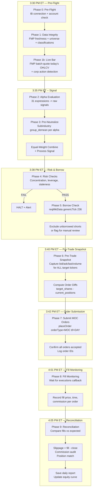

# IB Closing Auction MOC Trading System — Operations Manual

> **Version**: 1.1.0 | **Updated**: 2026-04-21 | **Account**: DUQ372830

---

## Table of Contents

1. [System Architecture](#system-architecture)
2. [TWS vs IB Gateway](#tws-vs-ib-gateway)
3. [Daily Timeline](#daily-timeline)
4. [Program Flow — All 9 Phases](#program-flow)
5. [Data Integrity Checks](#data-integrity-checks)
6. [Execution Tracking](#execution-tracking)
7. [Failure Modes & Recovery](#failure-modes)
8. [Scaling Plan](#scaling-plan)

---

## System Architecture



---

## TWS vs IB Gateway

**Zero code changes required to switch.** Both use the same TWS API protocol.

| Feature | TWS | IB Gateway |
|---------|-----|------------|
| GUI | Full trading GUI | Minimal login-only window |
| Resource usage | ~500MB RAM | ~200MB RAM |
| Auto-restart | Manual | Built-in (IBC can manage) |
| API port (paper) | 7497 | 7497 |
| API port (live) | 7496 | 7496 |
| `ib_insync` code | **Identical** | **Identical** |
| Best for | Initial debugging, manual overrides | Automated production systems |

**Recommendation**: Start with TWS for paper trading (easier to see positions, orders, fills visually). Switch to Gateway + IBC (IB Controller) for unattended production.

To switch: just change `port_paper` in `strategy.json` if Gateway uses a different port. Default is the same.

---

## Daily Timeline

```
 3:25 PM ET  ┌─ Scheduler triggers moc_trader.py
             │
 3:30 PM ET  +-  Phase 0: Pre-flight (IB connect, account check)
              +-- Phase 1: Data integrity (FMP freshness, universe, classifications)
              +-- Phase 1b: Live bar (FMP batch-quote -> today's OHLCV + corp action check)
              |
 3:33 PM ET  +-- Phase 2: Alpha evaluation (31 signals on TODAY's data, ~5s)
             ├─ Phase 3: Pre-neutralize + combine (~2s)
             │
 3:35 PM ET  ├─ Phase 4: Risk checks (~1s)
             ├─ Phase 5: Borrow availability (~10s for 126 shorts)
             │
 3:38 PM ET  ├─ Phase 6: Pre-trade snapshot (bid/ask/last for 213 tickers, ~15s)
             │
 3:40 PM ET  ├─ Phase 7: Submit MOC orders (213 orders, ~30s)
             │           All orders must be submitted by 3:45
             │
 3:45 PM ET  ├─ HARD DEADLINE — All orders confirmed submitted
             │
 3:50 PM ET  │  NYSE/AMEX MOC cutoff (no new MOC orders accepted)
 3:55 PM ET  │  NASDAQ MOC cutoff
             │
 4:00 PM ET  ├─ Market close. Closing auction executes.
             │
 4:01 PM ET  ├─ Phase 8: Fill monitoring begins
             │           Wait up to 5 minutes for execution reports
             │
 4:05 PM ET  ├─ Phase 9: Reconciliation
             │           Fill prices vs close prices vs pre-trade snapshot
             │           Commission audit, position check
             │
 4:10 PM ET  └─ Daily report saved. Disconnect.
```

---

## Program Flow — All 9 Phases

### Phase 0: Pre-Flight

```python
def phase_0_preflight():
    """
    Connect to IB. Verify account. Check system health.
    MUST pass before any other phase runs.
    """
    # 1. Connect to IB (TWS or Gateway, same code)
    ib.connect(host, port, clientId)

    # 2. Verify we're on the right account
    accounts = ib.managedAccounts()
    assert "DUQ372830" in accounts  # Paper account check

    # 3. Account summary
    nlv = account_summary["NetLiquidation"]  # Net liquidation value
    buying_power = account_summary["BuyingPower"]

    # 4. Verify market is open (not holiday/weekend)
    # 5. Check system clock is synced (NTP)
    # 6. Verify no pending orders from previous day
```

**Failure modes**:
- IB not running → abort, send alert
- Wrong account → abort (safety)
- Market closed → skip today

---

### Phase 1: Data Integrity

```python
def phase_1_data_integrity():
    """
    Verify ALL data is fresh and consistent before computing signals.
    This is the most critical safety check.
    """
    # A. FMP Data Freshness
    last_fmp_date = matrices["close"].index[-1]
    hours_stale = (now - last_fmp_date).total_seconds() / 3600
    assert hours_stale < 48, "STALE DATA — FMP not updated"

    # B. Universe Coverage
    n_tickers = universe_df.iloc[-1].sum()
    assert n_tickers >= 100, f"Universe has only {n_tickers} tickers"

    # C. Classification Sanity (run test subset)
    assert len(classifications["sector"].unique()) >= 8
    assert len(classifications["industry"].unique()) > len(classifications["sector"].unique())
    assert len(classifications["subindustry"].unique()) > len(classifications["industry"].unique())

    # D. Price Reasonableness
    last_close = matrices["close"].iloc[-1]
    assert last_close.median() > 1.0, "Median price < $1 — data corruption?"
    assert last_close.median() < 500.0, "Median price > $500 — wrong universe?"

    # E. Returns Sanity
    last_returns = matrices["returns"].iloc[-1]
    assert last_returns.abs().max() < 1.0, "Single-day return > 100% — split?"

    # F. Cross-validate FMP vs IB (sample 50 tickers)
    ib_prices = ib.get_last_close_prices(sample_50)
    mismatches = compare(fmp_last_close, ib_prices, tolerance=2%)
    assert mismatches < 5, "Too many price mismatches — possible splits"
```

**Data integrity checks summary**:

| Check | Threshold | Consequence |
|-------|-----------|-------------|
| FMP staleness | < 48 hours | HALT if stale |
| Universe size | >= 100 tickers | HALT if empty |
| Classification hierarchy | 3 distinct levels | HALT if broken |
| Median price | $1 - $500 | HALT if out of range |
| Max single-day return | < 100% | WARN, exclude ticker |
| FMP vs IB price match | < 5 mismatches / 50 | HALT if high mismatch |
| Returns all NaN | Any ticker | Exclude from signal |

---

### Phase 1b: Live Bar Construction (Delay-0)

> [!IMPORTANT]
> **This is the most critical data step.** The backtest uses `delay=0`, meaning day T's alpha expression evaluates on day T's OHLCV. In production at 3:40 PM, we don't have today's close yet, so we estimate it using the current price from FMP.

```python
def phase_1b_live_bar():
    """
    Construct today's estimated bar and append to matrices.
    Without this, signals would be computed on STALE T-1 data,
    making every alpha expression wrong.

    Fields used by our 31 alphas: close, open, high, low, volume, vwap, returns
    """
    # 1. Fetch live quotes from FMP batch-quote API
    quotes = fmp_batch_quote(all_tickers)  # 253 tickers in ~1s
    # Returns: {symbol: {price, open, dayHigh, dayLow, volume, previousClose, ...}}

    # 2. Corporate Action Detection (TEMPORARY 2% FILTER)
    #    Compare FMP previousClose vs our historical close.
    #    If |diff| > 2%, the ticker likely had a split or ex-div.
    #    CURRENT: Exclude via NaN (drops ~11 tickers/day)
    #    TODO: Compute adjustment ratio and retroactively fix historical data
    #          instead of excluding. This will recover signal for dropped tickers.
    for sym in quotes:
        pct_diff = abs(fmp_prevClose - hist_close) / hist_close
        if pct_diff > 0.02:  # 2% tolerance -- TEMPORARY
            flagged.append(sym)  # Will get NaN in live bar

    # 3. Construct live bar row
    live_close[sym] = quote["price"]      # Current price = estimated close
    live_open[sym]  = quote["open"]       # Today's actual open
    live_high[sym]  = quote["dayHigh"]    # Intraday high so far
    live_low[sym]   = quote["dayLow"]     # Intraday low so far
    live_vol[sym]   = quote["volume"]     # Partial day volume
    live_vwap[sym]  = (high + low + close) / 3  # Typical price proxy

    # 4. Append to matrices
    matrices["close"] = concat(hist_close_matrix, live_close_row)
    # ... same for open, high, low, volume, vwap

    # 5. Recompute returns from extended close
    matrices["returns"] = matrices["close"].pct_change()

    # 6. Extend universe (carry forward yesterday's membership)
    universe_df.loc[today] = universe_df.iloc[-1]
```

**Corporate action detection log (first run 2026-04-21)**:
```
BH     FMP_prevClose=$291.73 vs hist=$297.82 (2.0% diff)
CATX   FMP_prevClose=$4.55   vs hist=$4.74   (3.9% diff)
GBLI   FMP_prevClose=$28.58  vs hist=$27.50  (3.9% diff)
LVWR   FMP_prevClose=$1.92   vs hist=$2.07   (7.2% diff)
... 11 tickers total excluded
```

> [!WARNING]
> The 2% `previousClose` tolerance is a **temporary safeguard**. The proper fix is to detect the adjustment ratio (e.g., 2:1 split → ratio=2.0, $0.50 dividend → ratio = prevClose/adjPrevClose) and retroactively adjust our historical close/open/high/low/volume so the live bar connects cleanly. This would recover signal for ~11 tickers/day currently being dropped.

---

### Phase 2: Alpha Evaluation

```python
def phase_2_evaluate_alphas():
    """Compute all 31 alpha signals from FMP matrices."""
    for alpha_id, expression in alphas:
        raw_signal = FastExpressionEngine(matrices).evaluate(expression)
        # Each signal is a DataFrame: dates × tickers
        alpha_signals[alpha_id] = raw_signal

    assert len(alpha_signals) >= 25, "Too many alpha failures"
```

---

### Phase 3: Signal Construction (Pre-Neutralize + Combine)

```python
def phase_3_signal():
    """
    THE WINNING APPROACH from neutralization sweep:
    1. Pre-neutralize each alpha by subindustry (group_demean)
    2. Equal-weight average across all alphas
    3. Market demean + scale to unit exposure + clip at 1%

    This produced Test Sharpe +9.81 vs +8.02 for market-neutral baseline.
    """
    for alpha_id, raw in alpha_signals.items():
        # Apply universe mask
        masked = raw.where(universe_mask, NaN)
        # Remove subindustry mean (360 SIC-4 groups)
        demeaned = group_demean(masked, subindustry_groups)
        stack += demeaned

    combined = stack / count
    processed = process_signal(combined, universe)
    # processed.iloc[-1] is today's target weights
```

---

### Phase 4: Risk Checks

```python
def phase_4_risk_checks():
    """Pre-trade risk validation."""
    checks = {
        "max_position_weight": signal.abs().max() <= 0.015,
        "net_exposure": abs(signal.sum()) <= 0.10,     # < 10% net
        "sector_concentration": all_sectors <= 0.30,    # < 30% per sector
        "leverage": target_gmv / nlv <= 6.0,            # Portfolio margin limit
        "max_drawdown": current_dd < MAX_DD_HALT,       # Circuit breaker
        "min_positions": n_positions >= 50,              # Diversification
    }
    if any_fail: HALT_AND_ALERT()
```

---

### Phase 5: Short Borrow Availability

```python
def phase_5_borrow_check():
    """
    Query IB for shortable shares on each short target.
    Uses genericTickList='236' which returns:
      - shortableShares: number of shares available
      - shortable: float indicator (>2.5=easy, 1.5-2.5=limited, <1.5=hard)
      - shortFeeRate: annualized borrow fee rate

    Key concern: TOP2000-3000 stocks are small/mid-cap.
    Many may be hard to borrow or have high locate fees.
    """
    for short_ticker in short_targets:
        data = ib.reqMktData(contract, genericTickList="236")
        # Wait 3s for data
        result = {
            "shortable": data.shortableShares > 0,
            "shares_available": data.shortableShares,
            "borrow_fee": data.shortFeeRate,         # annualized %
            "status": "EASY" | "LIMITED" | "HARD",
        }

    # Decision: exclude HARD_TO_BORROW tickers from signal
    # or keep and let IB reject the order (safer to pre-filter)
```

**Borrow data logging**: Every day we save a JSON snapshot to `prod/logs/borrow/` so we can build a historical borrow availability database. This is critical for understanding which stocks in our universe are reliably shortable.

---

### Phase 6: Pre-Trade Snapshot (EXECUTION TRACKING)

> [!IMPORTANT]
> This is the key execution quality measurement. We capture the full market state at signal computation time so we can later measure if our MOC fills are getting the expected prices.

```python
def phase_6_pretrade_snapshot():
    """
    Capture bid/ask/last/volume for EVERY target ticker at signal time.
    This becomes the benchmark for execution quality analysis.
    """
    snapshot = {}
    for ticker in all_target_tickers:  # Both longs and shorts
        contract = Stock(ticker, "SMART", "USD")
        data = ib.reqMktData(contract)
        ib.sleep(0.5)  # Let data arrive

        snapshot[ticker] = {
            "time": datetime.now().isoformat(),
            "bid": data.bid,
            "ask": data.ask,
            "last": data.last,
            "mid": (data.bid + data.ask) / 2,
            "spread_bps": (data.ask - data.bid) / data.mid * 10000,
            "volume": data.volume,        # Shares traded today
            "close_t1": fmp_last_close[ticker],  # Yesterday's close from FMP
            "target_weight": signal_row[ticker],
            "target_shares": target_shares[ticker],
            "target_side": "LONG" if target_shares[ticker] > 0 else "SHORT",
            "target_dollars": abs(target_shares[ticker] * data.last),
        }

        ib.cancelMktData(contract)

    # Save snapshot
    save_json(f"prod/logs/trades/pretrade_{date}.json", snapshot)
```

---

### Phase 7: MOC Order Submission

```python
def phase_7_submit_orders():
    """
    Submit Market-on-Close orders for all diffs.
    MOC orders execute at the official closing price determined
    by the closing auction (NYSE, NASDAQ, AMEX).
    """
    # Minimum order filter — skip tiny orders to reduce commission drag
    # Configured in strategy.json: "min_order_value": 200 (set to 0 to disable)
    min_order = config["execution"]["min_order_value"]  # default $200
    if min_order > 0:
        order_diffs = {sym: qty for sym, qty in order_diffs.items()
                       if abs(qty) * price[sym] >= min_order}

    # Deadline check
    assert now.time() < time(15, 45), "PAST DEADLINE"

    for ticker, diff_shares in order_diffs.items():
        order = Order(
            action="BUY" if diff_shares > 0 else "SELL",
            totalQuantity=abs(diff_shares),
            orderType="MOC",
            tif="DAY",
        )
        trade = ib.placeOrder(contract, order)

        order_log = {
            "symbol": ticker,
            "order_id": trade.order.orderId,
            "action": order.action,
            "quantity": order.totalQuantity,
            "order_type": "MOC",
            "submitted_at": datetime.now().isoformat(),
            "status": "SUBMITTED",
            "pretrade_bid": snapshot[ticker]["bid"],
            "pretrade_ask": snapshot[ticker]["ask"],
            "pretrade_mid": snapshot[ticker]["mid"],
        }
```

**Min order filter impact** (at $500k GMV, $200 threshold):
- Skips ~13 orders worth ~$1,500 total (0.3% of book)
- Saves ~$4.55/day in IBKR minimums = ~$1,146/year
- At $100k GMV: eliminates ~62 orders (30%), saving ~$5,500/year

---

### Phase 8: Fill Monitoring

```python
def phase_8_fill_monitoring():
    """
    After 4:00 PM, monitor for execution reports.
    MOC orders fill at the official closing price.

    ib_insync provides fills via:
      - trade.fills: list of Fill objects
      - trade.orderStatus: status updates
      - ib.executions(): all executions for the day
    """
    # Wait for market close
    wait_until(time(16, 1))

    # Collect all fills
    executions = ib.executions()
    fills_log = {}

    for execution in executions:
        fills_log[execution.contract.symbol] = {
            "exec_id": execution.execution.execId,
            "fill_price": execution.execution.price,
            "fill_quantity": execution.execution.shares,
            "fill_time": execution.execution.time,
            "exchange": execution.execution.exchange,
            "commission": execution.commissionReport.commission,
            "realized_pnl": execution.commissionReport.realizedPNL,
        }

    # Save fills
    save_json(f"prod/logs/fills/fills_{date}.json", fills_log)

    # Check fill rate
    n_filled = len(fills_log)
    n_expected = len(order_diffs)
    fill_rate = n_filled / n_expected
    assert fill_rate > 0.95, f"Low fill rate: {fill_rate:.1%}"
```

---

### Phase 9: Reconciliation

> [!IMPORTANT]
> This is how we measure real execution quality and detect any systematic issues.

```python
def phase_9_reconciliation():
    """
    Compare actual fills to expectations across multiple benchmarks.
    This is the core execution analytics engine.
    """
    report = {
        "date": today,
        "fill_rate": n_filled / n_expected,
        "per_ticker": {},
    }

    for ticker in all_target_tickers:
        fill = fills_log.get(ticker, {})
        pre = snapshot.get(ticker, {})

        if not fill:
            report["per_ticker"][ticker] = {"status": "UNFILLED"}
            continue

        fill_price = fill["fill_price"]
        report["per_ticker"][ticker] = {
            # Prices
            "fill_price": fill_price,
            "pretrade_bid": pre["bid"],
            "pretrade_ask": pre["ask"],
            "pretrade_mid": pre["mid"],
            "fmp_close_t1": pre["close_t1"],
            "commission": fill["commission"],

            # Slippage measures (all in bps)
            "slippage_vs_mid_bps": (fill_price - pre["mid"]) / pre["mid"] * 10000,
            "slippage_vs_close_bps": 0,  # MOC should be exactly 0
            "spread_at_signal_bps": pre["spread_bps"],

            # Execution quality
            "fill_exchange": fill["exchange"],
            "fill_time": fill["fill_time"],
        }

    # Aggregate metrics
    slippages = [t["slippage_vs_mid_bps"] for t in report["per_ticker"].values()
                 if "slippage_vs_mid_bps" in t]
    report["aggregate"] = {
        "mean_slippage_vs_mid_bps": np.mean(slippages),
        "median_slippage_vs_mid_bps": np.median(slippages),
        "std_slippage_bps": np.std(slippages),
        "total_commission": sum(t.get("commission", 0)
                               for t in report["per_ticker"].values()),
        "fill_rate": fill_rate,
        "n_positions": len(fills_log),
    }

    # Daily PnL (from IB account values)
    report["pnl"] = {
        "nlv_start": start_of_day_nlv,
        "nlv_end": end_of_day_nlv,
        "daily_pnl": end_of_day_nlv - start_of_day_nlv,
        "daily_return_pct": (end_of_day_nlv - start_of_day_nlv) / start_of_day_nlv * 100,
    }

    save_json(f"prod/logs/performance/recon_{date}.json", report)
```

### Execution Quality Metrics (tracked daily)

| Metric | Description | Expected |
|--------|-------------|----------|
| Fill rate | Orders filled / orders submitted | > 99% |
| Slippage vs mid (bps) | Fill price - mid price at signal time | ~0 (MOC = close) |
| Slippage vs FMP close (bps) | Fill price - FMP T-1 close | Random (day's return) |
| Spread at signal (bps) | Bid-ask spread when signal was computed | 20-100 bps for small-caps |
| Commission per share | Actual IBKR charge | $0.0005-$0.0035 |
| Commission per day | Total daily commission cost | ~$16 at $500k GMV |
| Fill time | When execution occurred | 16:00:00-16:00:05 ET |
| Exchange | Where order was filled | NYSE/NASDAQ/AMEX |

---

## Data Integrity Checks — Complete List

> [!CAUTION]
> ALL of these checks must pass before Phase 7 (order submission). Any HALT-level failure aborts the entire trading day.

### Pre-Signal Checks (Phase 1)

| # | Check | Level | Threshold | Action if Fail |
|---|-------|-------|-----------|----------------|
| 1 | FMP data freshness | HALT | Last date < 48h ago | Abort; investigate FMP pipeline |
| 2 | Universe size | HALT | >= 100 tickers active | Abort; data issue |
| 3 | Classification levels | HALT | sector < industry < subindustry groups | Abort; run `rebuild_classification_matrices.py` |
| 4 | Median price range | HALT | $1 < median < $500 | Abort; data corruption |
| 5 | Max single-day return | WARN | < 100% per ticker | Exclude ticker; possible split |
| 6 | FMP vs IB price match | HALT | < 5/50 mismatches | Abort; splits or data lag |
| 7 | NaN coverage | WARN | < 20% NaN in close | Exclude high-NaN tickers |
| 8 | Volume sanity | WARN | Median volume > 1000 | Exclude illiquid tickers |

### Pre-Trade Checks (Phase 4)

| # | Check | Level | Threshold | Action if Fail |
|---|-------|-------|-----------|----------------|
| 9 | Max position weight | HALT | <= 1.5% | Abort; signal defect |
| 10 | Net exposure | WARN | < 10% | Log; monitor |
| 11 | Sector concentration | WARN | < 30% per sector | Log; tighten cap |
| 12 | Leverage | HALT | < 6x NLV | Abort; reduce GMV |
| 13 | Drawdown circuit breaker | HALT | < 15% from peak | Halt all trading |
| 14 | Min positions | WARN | >= 50 | Log; low diversification |
| 15 | Borrow availability | WARN | Note hard-to-borrow | Exclude or flag |

### Post-Trade Checks (Phase 9)

| # | Check | Level | Threshold | Action if Fail |
|---|-------|-------|-----------|----------------|
| 16 | Fill rate | HALT next day | > 95% | Investigate unfilled orders |
| 17 | Position reconciliation | HALT next day | IB positions = expected | Resolve discrepancies |
| 18 | Commission audit | WARN | Within 20% of expected | Verify tier rate |
| 19 | Slippage outliers | WARN | < 50 bps mean slippage | Investigate |

---

## Failure Modes & Recovery

### IB Connection Failure

```
Trigger: ib.connect() raises exception
Impact:  Cannot trade today
Recovery:
  1. Check TWS/Gateway is running
  2. Check API port is correct (7497 paper, 7496 live)
  3. Check "Enable API" in TWS settings
  4. Retry up to 3 times with 10s delay
  5. If still failing: alert and skip today
```

### FMP Data Stale

```
Trigger: Last FMP date > 48 hours old
Impact:  Signal based on stale data = wrong positions
Recovery:
  1. Check FMP API key and rate limits
  2. Run manual data refresh
  3. If FMP is down: use IB historical data as backup
  4. NEVER trade on stale data
```

### MOC Deadline Missed

```
Trigger: All orders not submitted by 3:45 PM ET
Impact:  NYSE/AMEX orders rejected after 3:50
Recovery:
  1. This should never happen (30s signal + 30s submit = 1 min)
  2. If it does: investigate signal computation bottleneck
  3. Consider pre-computing signal earlier and only connecting at 3:40
```

### Hard-to-Borrow Shorts

```
Trigger: IB reports shares unavailable for shorting
Impact:  Cannot establish short position → portfolio drift from target
Recovery:
  1. Log all HTB tickers daily in borrow snapshots
  2. Short-term: zero out HTB tickers and re-scale remaining shorts
  3. Medium-term: build HTB history database and exclude
     chronically-unborrowed tickers from universe
  4. Long-term: consider SBL (Securities Borrowing & Lending) desk
```

### Order Rejection

```
Trigger: IB rejects MOC order (insufficient margin, halted stock, etc.)
Impact:  Missing position in portfolio
Recovery:
  1. Log rejection reason
  2. If margin: reduce GMV
  3. If halted: exclude ticker, recalculate signal
  4. If pattern: investigate and fix root cause
```

### Price Mismatch (FMP vs IB)

```
Trigger: > 2% price difference for > 5 tickers
Impact:  Likely stock split not reflected in FMP data
Recovery:
  1. Identify affected tickers
  2. Check for corporate actions (splits, dividends, mergers)
  3. Exclude affected tickers from today's signal
  4. Update FMP data pipeline with split adjustment
```

---

## Scaling Plan

### Phase 1: Paper Validation ($0 real capital)

- **Duration**: 5-10 trading days
- **Goal**: Validate execution, fills, slippage
- **Key metrics**: Fill rate, slippage, commission accuracy
- **Exit criteria**: 5 consecutive clean days with > 98% fill rate

### Phase 2: Small Live ($110k equity, $250k GMV)

- **Duration**: 20 trading days (1 month)
- **Goal**: Validate live P&L vs backtest, measure real impact
- **Key metrics**: Daily PnL tracking, realized vs expected Sharpe
- **Exit criteria**: Realized Sharpe > 3.0 over 20 days

### Phase 3: Target Live ($110k equity, $500k GMV)

- **Duration**: 60 trading days (3 months)
- **Goal**: Full target allocation, establish track record
- **Key metrics**: Monthly returns, max drawdown, commission costs
- **Exit criteria**: Sharpe > 5.0, max DD < 5%

### Phase 4: Scale Up ($500k+ equity, $2M+ GMV)

- **Duration**: Ongoing
- **Changes needed**:
  - Move to IB Gateway (headless)
  - Add redundant data source (IB + FMP)
  - Deploy on dedicated server (not personal workstation)
  - Add monitoring dashboard
  - Consider Reg-T vs Portfolio Margin optimization

### Phase 5: Institutional ($5M+ equity, $20M+ GMV)

- **Changes needed**:
  - Multiple prime broker relationships for better borrow
  - FIX protocol direct to exchanges
  - Dedicated SBL (securities lending) desk
  - Real-time risk monitoring
  - Fund administrator
  - Compliance infrastructure (13F filings, etc.)

---

## Commands Reference

```bash
# Dry-run (no IB needed — test signal pipeline)
python prod/moc_trader.py

# Check borrow availability only (needs IB)
python prod/moc_trader.py --check-borrow

# Paper trading
python prod/moc_trader.py --live

# Override GMV
python prod/moc_trader.py --live --gmv 250000

# Live trading (DANGER)
python prod/moc_trader.py --live --port 7496
```

---

## Log File Locations

| Log | Path | Format | Frequency |
|-----|------|--------|-----------|
| Trade decisions | `prod/logs/trades/trade_YYYY-MM-DD.json` | JSON | Daily |
| Pre-trade snapshot | `prod/logs/trades/pretrade_YYYY-MM-DD.json` | JSON | Daily |
| Execution fills | `prod/logs/fills/fills_YYYY-MM-DD.json` | JSON | Daily |
| Reconciliation | `prod/logs/performance/recon_YYYY-MM-DD.json` | JSON | Daily |
| Borrow availability | `prod/logs/borrow/borrow_YYYY-MM-DD.json` | JSON | Daily |
| System log | `prod/logs/trades/moc_YYYY-MM-DD.log` | Text | Daily |
