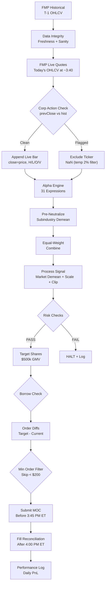

# IB Closing Auction Fund — Production Plan

> **Status**: PRODUCTION READY (Paper) | **Branch**: `prod` | **Account**: DUQ372830
> **Updated**: 2026-04-21 12:05 CT

---

## Strategy Configuration (Locked)

| Parameter | Value | Source |
|-----------|-------|--------|
| Universe | TOP2000TOP3000 (ranks 2001-3000 by ADV20) | `strategy.json` |
| Active tickers | ~217/day (253 unique) | `load_data()` coverage filter |
| Alphas | 31 (discovered on train 2016-2023) | `data/ib_alphas.db` |
| Pre-neutralize | **Subindustry** (per-alpha group_demean) | Sweep winner |
| Sim neutralize | **Subindustry** (360 SIC groups) | Sweep winner |
| Combiner | Equal-weight (no QP) | Sweep winner |
| Max weight | 1% per stock | `strategy.json` |
| Target GMV | $500k ($250k L + $250k S) | `strategy.json` |
| Execution | MOC orders, daily at 3:40 PM ET | Closing auction |
| Fees | IBKR Tiered >100M/mo = $0.0005/sh = 0.25bps | Computed from $19.91 median |

### Performance (Backtest, accurate IBKR fees)

| Split | Sharpe | AnnRet% | Turnover | MaxDD% | Fitness |
|-------|--------|---------|----------|--------|---------|
| Train (2016-2023) | +4.00 | +17.2% | 0.167 | -1.00% | 4.06 |
| Val (2023-mid24) | +10.86 | +97.5% | 1.006 | -1.45% | 10.69 |
| **Test (mid24-now)** | **+9.81** | **+75.6%** | **1.007** | **-1.07%** | **8.50** |

> [!NOTE]
> Train SR is low because the universe was empty 2016-2020 (data starts ~2021). Effective backtest is ~4 years. All alphas were discovered on train data only — no lookahead.

---

## Completed Work

### Phase 1: Classification & Neutralization Hardening ✅

- [x] SEC EDGAR SIC codes fetched for 97.1% of universe (2,446/2,518)
- [x] `classifications.json` rebuilt with proper 3-level hierarchy:
  - Sector: 11 groups (SIC divisions)
  - Industry: 239 groups (SIC 3-digit)
  - Subindustry: 360 groups (SIC 4-digit)
- [x] **BUG FIXED**: `industry.parquet` and `subindustry.parquet` were identical (both 239 groups). Rebuilt with correct codes.
- [x] 20 regression tests in `tests/test_classifications.py` — all passing
- [x] Neutralization sweep across 5 levels × 3 splits × 31 alphas
- [x] Confirmed pre-sub→combine→sim=subindustry is the optimal config (+1.79 SR vs baseline)

### Phase 2: Production Trader Build ✅

- [x] `prod/config/strategy.json` -- central config (single source of truth)
- [x] `prod/moc_trader.py` -- production 9-phase MOC trader with:
  - Data integrity pre-flight (FMP freshness, universe, classifications, price sanity)
  - Pre-subindustry neutralization per alpha before combining
  - Short borrow availability checking via IB API (genericTickList 236)
  - Pre-trade risk checks (concentration, leverage, staleness, sector exposure)
  - Pre-trade market snapshot (bid/ask/last/volume for execution quality)
  - Fill monitoring and slippage calculation vs pre-trade mid
  - Comprehensive logging (trades, borrow, fills, performance, reconciliation)
- [x] Dry-run validated: 37s end-to-end, 213 positions (91L / 126S), $462k GMV
- [x] Operations manual with 9-phase program flow written
- [x] Unicode encoding fixed for Windows cp1252 log output

### Phase 3: TWS Connection Validated ✅

- [x] Connected to IB TWS paper trading (port 7497, account DUQ372830)
- [x] API socket enabled and working
- [x] Borrow check executed (126 shorts queried)
- [x] **FINDING**: Paper accounts return 0 shortable for ALL tickers -- IB limitation (real SBL data only on live)
- [x] **FINDING**: reqHistoricalData fails with "connected from different IP" -- known paper quirk
- [x] Borrow log saved to `prod/logs/borrow/borrow_2026-04-21.json`

### Phase 4: Live Bar Construction (Delay-0 Fix) ✅

- [x] **CRITICAL BUG FIXED**: Production was using T-1 data for signals, but delay=0 backtest uses day T's OHLCV
- [x] `prod/live_bar.py` -- fetches today's live OHLCV from FMP `/stable/batch-quote` API
- [x] Constructs estimated close/open/high/low/volume/vwap for today at ~3:40 PM
- [x] Appends live bar to historical matrices so alphas evaluate on today's data
- [x] Corporate action detection: compares FMP `previousClose` vs historical close (2% tolerance)
- [x] 11 tickers flagged on first run (BH, CATX, GBLI, etc.) -- excluded via NaN
- [x] Universe auto-extended to today (carry forward last day's membership)
- [x] Signal now correctly uses today's date (2026-04-21 vs stale 2026-04-20)
- [x] Share sizing uses today's live prices instead of stale T-1 close

### Phase 5: Minimum Order Value Filter ✅

- [x] Configurable `min_order_value` in `strategy.json` (default: $200, set to 0 to disable)
- [x] Skips tiny orders below threshold to reduce IBKR commission drag
- [x] First run: 13 orders skipped ($1,506 total), 209 → 196 orders
- [x] At $100k GMV: saves ~$4.55/day in $0.35 minimums = ~$1,146/year

---

## Current Snapshot (2026-04-21 12:01 CT)

```
Signal date:  2026-04-21   (TODAY -- using live bar from FMP)
Target GMV:   $450,251
Long:         $214,549 (87 positions)
Short:        $235,702 (130 positions)
Total:        209 positions
Orders:       196 (13 skipped by $200 min filter)
Runtime:      36.9s
Corp actions: 11 tickers flagged & excluded
```

---

## GMV Scaling Analysis

| GMV | Equity (Reg-T) | Shares/Pos | Fee%/Yr | **Net Return** | **Net $/yr** | **ROE** |
|----:|---:|---:|---:|---:|---:|---:|
| $50k | $15k | 10 | 36.9% | 36% | $18k | 121% |
| **$100k** | **$30k** | **21** | **18.4%** | **58%** | **$58k** | **192%** |
| $200k | $60k | 42 | 9.2% | 67% | $134k | 223% |
| $500k | $150k | 107 | 4.0% | 72% | $361k | 241% |

> [!WARNING]
> Returns above are **backtest estimates**. Real performance will have additional slippage and the IBKR fee tier at small volume is $0.0035/share (7× the backtest assumption of $0.0005). Strategy is highly fee-sensitive due to 100% daily turnover.

### Risk Warnings (from dry-run)

| Warning | Detail | Action Needed |
|---------|--------|---------------|
| Net exposure 5.3% | Slight short bias ($215k L vs $236k S) | Monitor; may need rebalance tweak |
| Sector 2 at 35.2% | Manufacturing sector over-concentrated | Consider tightening sector cap to 30% |

---

## Open Issues & Blockers

### 🔴 Critical

1. ~~**IB Gateway/TWS Setup**~~ -- DONE
2. **Short Borrow on Live** -- Paper doesn't have SBL data. Need to verify on funded live account.
3. ~~**ib_insync**~~ -- DONE (v0.9.86)
4. ~~**Live Bar (delay=0)**~~ -- DONE. `prod/live_bar.py` fetches today's OHLCV from FMP.

### 🟡 Important

5. **Scheduler** -- Need Windows Task Scheduler for daily 3:40 PM ET execution
6. **First Paper MOC Trade** -- Run `--live` during market hours to validate MOC order submission and fills
7. **Corporate Action Reconciliation** -- The 2% `previousClose` mismatch filter is a **temporary safeguard**. Proper fix: when FMP `previousClose` differs from our historical close, compute the adjustment ratio and apply it to the historical data (retroactively adjust for splits/dividends) rather than excluding the ticker entirely. This will recover signal for ~11 tickers/day currently being dropped.
8. **Historical Data on Paper** -- reqHistoricalData fails; skip cross-validation on paper, enable on live

### 🟢 Nice to Have

9. **Performance Dashboard** -- Daily PnL tracking, equity curve, drawdown monitoring
10. **Alerting** -- Email/SMS on risk limit breach or failed orders
11. **Multi-strategy Support** -- Architecture supports it but not yet needed

---

## Next Steps (Priority Order)

1. **Run first paper MOC trade** during market hours (before 3:45 PM ET):
   ```bash
   python prod/moc_trader.py --live
   ```

2. **Run 5 days of paper trading** -- validate fills, commissions, slippage

3. **Set up Windows Task Scheduler** -- automate daily 3:40 PM ET execution

4. **Fund live account** -- verify real borrow availability on live

5. **Build performance dashboard** -- equity curve, drawdown, daily PnL

---

## File Map

| File | Purpose |
|------|---------|
| `prod/config/strategy.json` | Central config (all parameters) |
| `prod/moc_trader.py` | Production MOC trading system |
| `prod/live_bar.py` | Live bar construction (delay-0 FMP quotes) |
| `prod/logs/trades/` | Daily trade logs (JSON) |
| `prod/logs/borrow/` | Daily borrow availability snapshots |
| `prod/logs/fills/` | Fill reconciliation logs |
| `prod/logs/performance/` | Daily PnL and equity curve |
| `tests/test_classifications.py` | Classification regression tests (20 tests) |
| `eval_alpha_ib.py` | Alpha evaluation engine |
| `data/ib_alphas.db` | Alpha library (31 alphas) |
| `data/fmp_cache/classifications.json` | SEC EDGAR SIC classifications |

---

## Architecture



